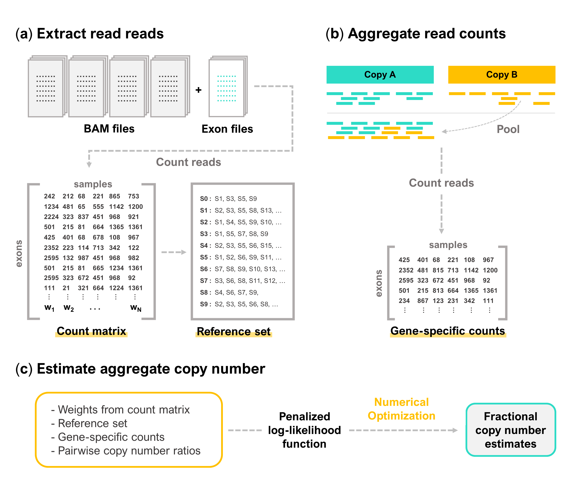

# Exome-Parascopy

Exome-Parascopy is a computational method for accurate estimation of copy number for duplicated genes using exome sequencing.



### Count matrix

We can extract read count data from all input files and construct a count matrix (or read depth matrix) across all exons and all input samples (BAM files)
```
python run_getBamCounts.py \
-i EUR.bam.fp.list \
-o results-EUR \
-x exons/exons.hg38.noalt.bed \
-t 16
```

### Gene-specific count matrix
Using Parascopy's pool function, we can re-map reads initially aligned to Copy B to Copy A. This will allow us to obtain an aggregate read counts for the duplicated gene of interest.
```
python run_paras_pool.py \
-i EUR.bam.fp.colons.list \
-o results-EUR-SMN1 \
-f data/GCA_000001405.15_GRCh38_no_alt_plus_hs38d1_analysis_set.fna \
-t data/homology_table/hg38.bed.gz \
-g hg38 \
-l SMN1 \
-r chr5:70895669-70958942 \
-@ 16
```
Here, it is important that each line of input list must contain filepath and sample name separated by two colons. For example, every line must be in the following format: `data/bams/HG0001.exome.bam::HG001`.


### Reference set
Building the reference set is an essential step for our main algorithm. This step might take some time depending on the number of input samples and number of exons.
```
python build_referencesets.py all.counts.EUR.exons.tsv > EUR.betafit.out
```

### True copy numbers 
We also need to get the true copy numbers of samples that will serve as ground-truth values when calculating accuracy. Here, we use `res.samples.bed` from Parascopy output.

By default, copy number estimate at the mid-point of the gene is selected as the single point estimate of the true copy number of the gene.
```
python get_true_cn.py ground-truths/res.samples.EUR.SMN1.bed > EUR.SMN1.truecn.out
```

If instead we wish to select a specific index of copy number intervals as the point estimate, we can also run 
```
python get_true_cn.py ground-truths/res.samples.EUR.SMN1.bed -d 1 > EUR.SMN1.truecn.out
```
where `-d` represents the 0-based index.

### Main algorithm 

Now, we can run the main algorithm and also obtain the general accuracy statistics ouput using the following command:
```
python main.py \
-i EUR.SMN1.counts.exons.tsv \
-o EUR.SMN1.out \
-p EUR.betafit.out \
--truth EUR.SMN1.truecn.out \
-c 4
```
where `-c` represents the normal reference aggregate copy number. 

This will produce an output file like `EUR.SMN1.out` which will contain summaries of `connected components`, `fractionalCN`, `integerCN`, `trueCN`, etc. 

### Benchmark

To compute precision and recall of a single population or a single output file, run
```
python compute_prec_rec.py -i EUR.SMN1.out -c 4
```

To compute precision and recall across multiple populations or multiple files altogether, run
```
python compute_prec_rec.py -I EUR.SMN1.out AFR.SMN1.out AMR.SMN1.out EAS.SMN1.out SAS.SMN1.out -c 4
```
